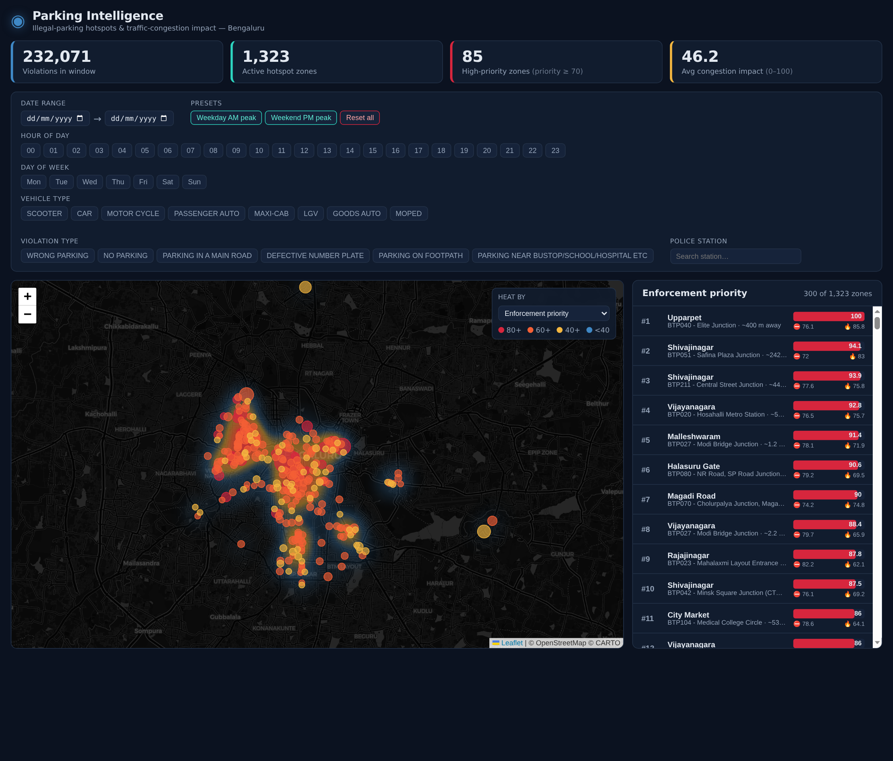
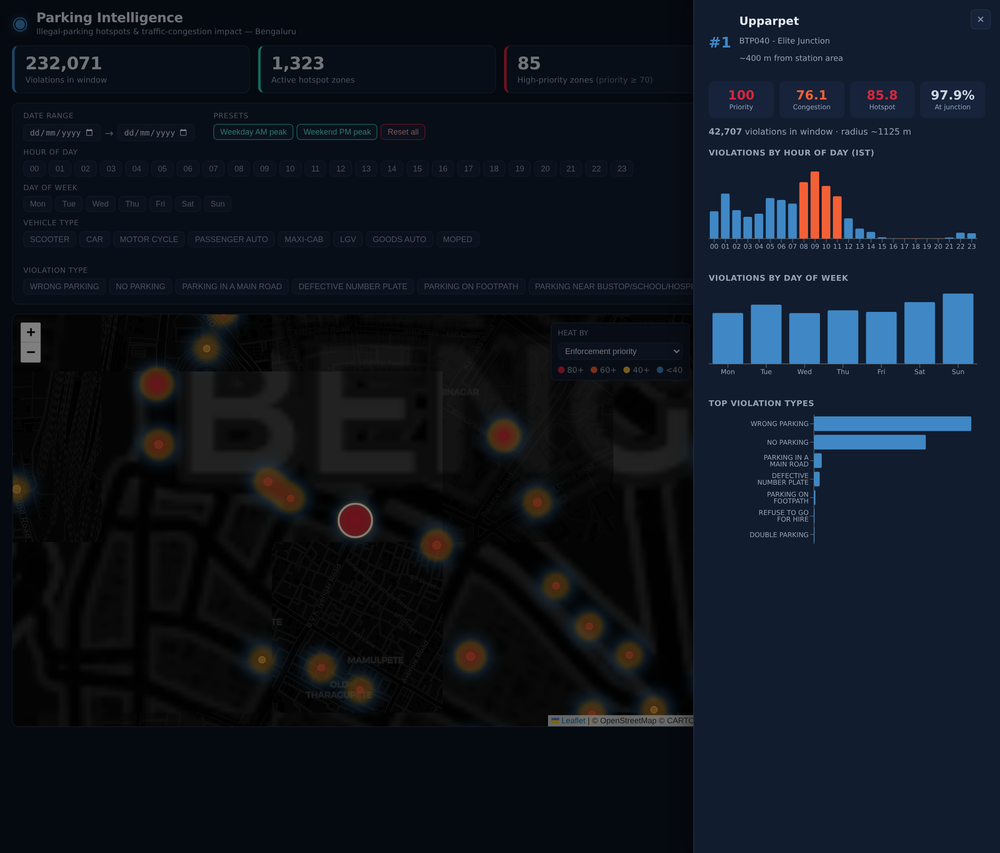
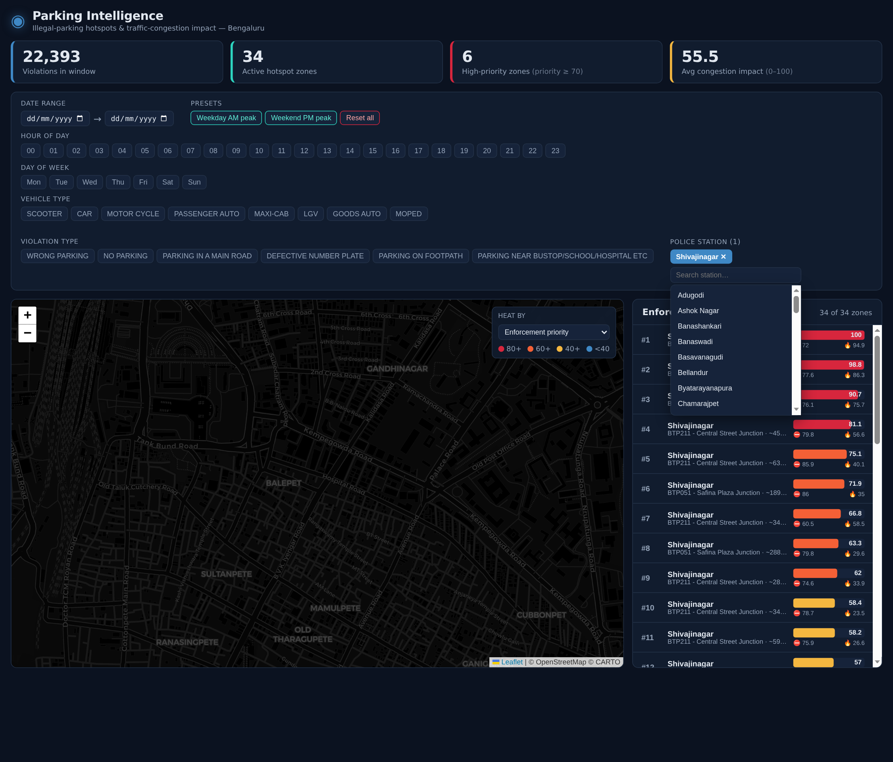

<div align="center">

# Parking Intelligence

### From reactive patrols to predictive enforcement.

**AI-driven illegal-parking hotspot detection and traffic-congestion impact scoring for Bengaluru.**

Built for the **Flipkart Gridlock Hackathon**.

`FastAPI` · `scikit-learn (DBSCAN)` · `pandas` · `React + Vite` · `Leaflet` · `Recharts`

</div>

---

## The Problem

> *On-street illegal parking and spillover parking near commercial areas, metro stations, and events
> choke carriageways and intersections.* — Flipkart Gridlock brief

Today, enforcement of this is **patrol-based and reactive**:

- Officers only learn about a hotspot by driving past it, or after a complaint.
- There's **no heatmap** comparing where violations happen against how much they actually congest traffic.
- With limited patrol units, there's **no ranked answer** to *"which hotspot deserves attention first?"*

**Our question:** How can AI-driven parking intelligence detect illegal-parking hotspots **and quantify
their impact on traffic flow** to enable *targeted* enforcement?

---
## Links

| Resource | Link |
|----------|------|
| Working Prototype | [Open](https://bengaluru-parking-intelligence-beryl.vercel.app/) |
| Demo Video | [Watch](https://youtu.be/piWuZm0jfX8) |## What This Does
---
It turns **248,691 raw parking tickets into 1,323 ranked, patrol-sized hotspots** — ranked not by
*how many* violations happened, but by *how much each one actually disrupts traffic flow*.

| | |
|---|---|
| **248,691** | cleaned violation tickets (Nov 2023 – Apr 2024) |
| **1,323** | patrol-sized hotspot zones discovered |
| **232,071 (93.3%)** | violations mapped to a real hotspot |
| **85** | zones flagged high-priority for enforcement |

The output is a **live, filterable dashboard** an officer can use to decide where to send the next
patrol — by jurisdiction, time of day, day of week, vehicle type, and violation type.

### Key features
-  **Interactive heatmap** of Bengaluru, with zones colored by enforcement priority.
- **Three transparent scores per zone** — Hotspot, Congestion Impact, and a blended Priority.
- **Volume ≠ Impact** — a smaller hotspot choking a junction outranks a bigger one sitting somewhere harmless.
- **On-demand filtering** — every score recomputes live for the exact time/jurisdiction window you pick.
- **Jurisdiction view** — filter to a single police station to see only that station's ranked zones.
- **Zone drill-down** — hour-of-day, day-of-week, violation-type and vehicle-type breakdowns per zone.

---

## The Dashboard

### 1. Operations overview



One screen an officer can act from. Everything updates together the moment a filter changes.

- **KPI bar** — violations in the current window, active hotspot zones, high-priority count, and average congestion impact.
- **Filter bar** — date range, hour-of-day, day-of-week, vehicle type, violation type, and police station, plus one-click rush-hour presets.
- **Priority heatmap** — every hotspot zone on a dark city map, colored by enforcement priority (red = critical → blue = low). The "Heat by" control re-weights the layer between priority, congestion impact, hotspot intensity, or raw volume.
- **Enforcement priority list** — the ranked worklist on the right; each row shows the priority bar plus congestion (⛔) and hotspot (🔥) sub-scores.

### 2. Zone drill-down



Click any zone — on the map or in the list — to open its profile for the current filter window.

- **Four scores at a glance** — Priority, Congestion, Hotspot, and the share of the zone's violations sitting at a junction.
- **Violations by hour of day** — peak-hour bars highlighted, so you can see *when* to deploy.
- **Violations by day of week** and **top violation types** — what kind of problem this zone actually is (here: Upparpet / Elite Junction, priority 100, 42,707 violations).

### 3. Jurisdiction filter



Enforcement is organized by police station, so the searchable **Police Station** filter narrows the *entire* dashboard — map, KPIs, and ranked list — to a single jurisdiction. A station's officers see only their own zones, ranked among themselves.

---

## How It Works

```
  jan to may police violation CSV  (~109 MB raw tickets)
            │
            ▼   backend/data_pipeline.py     ← run once (offline)
   ┌─────────────────────────────────────┐
   │ 1. Clean   → drop rejected/invalid, UTC→IST, Bengaluru bbox
   │ 2. Cluster → DBSCAN + recursive patrol-sizing → 1,323 zones
   │ 3. Persist → backend/artifacts/*.parquet
   └─────────────────────────────────────┘
            │   violations.parquet · zones.parquet · stations.parquet
            ▼   backend/scoring.py            ← per request (on-demand)
   ┌─────────────────────────────────────┐
   │ hotspot_score · congestion_impact · priority_score   (each 0–100)
   └─────────────────────────────────────┘
            │
            ▼   backend/api.py  (FastAPI)  ──HTTP──▶  frontend/  (React + Vite + Leaflet)
```

**Why two stages?** Spatial clustering is stable and expensive, so it's precomputed once. But *which*
hotspots matter depends entirely on the time/jurisdiction window the operator picks, so the scores are
recomputed per request from the precomputed artifacts.

### Stage 1 — Clustering (the engineering judgment call)

A naive grid would cut a real hotspot in half at a cell boundary. Instead we use **DBSCAN** (density-based
clustering, haversine metric): stand at any violation — if ≥ 12 others sit within 150 m, it's a dense, real
cluster; otherwise it's noise. DBSCAN finds clusters of any shape and needs no preset cluster count.

**The fix we added:** plain DBSCAN "chains" dense corridors into one multi-kilometre mega-cluster no patrol
can cover. So whenever a cluster's bounding radius exceeds **200 m**, we re-run DBSCAN on just those points
with a smaller `eps`, **recursively**, until every zone is patrol-sized (or `eps` bottoms out at 30 m).

### Stage 2 — The Scoring Model

All three scores are **0–100**, recomputed relative to the current filtered set of zones.

| Score | Question it answers | How it's built |
|---|---|---|
| **`hotspot_score`** | Is this a real, repeated problem? | `0.6 × log(volume) + 0.4 × log(density per unit area)`, min-max normalized |
| **`congestion_impact`** | How much does it choke traffic? | `0.45 × junction proximity + 0.40 × obstruction severity + 0.15 × peak-hour share` |
| **`priority_score`** | Where do we send the patrol? | `0.45 × hotspot + 0.55 × congestion`, normalized — deliberately favours impact over raw volume |

**Obstruction severity** is a hand-built table per violation type (`OBSTRUCTION_WEIGHTS`, 0 = no flow
impact, 1 = severe):

| Violation type | Weight |
|---|---|
| Parking in a main road · Double parking | 1.00 |
| Parking near road crossing / traffic light | 0.95 |
| Wrong parking | 0.70 |
| No parking | 0.55 |
| Parking on footpath | 0.40 |
| Defective number plate · no side mirror · fare offences | 0.00 |

**Peak hours** (IST) used for the congestion peak-share term: `08–11` and `17–20`.

---

## Project Structure

```
flipkart gridlock_hackathon/
├── backend/
│   ├── data_pipeline.py     # Phase 1 — clean + DBSCAN clustering → parquet artifacts (run once)
│   ├── scoring.py           # Phase 2 — on-demand hotspot/congestion/priority scoring
│   ├── api.py               # Phase 3 — FastAPI app
│   └── artifacts/           # generated parquet data (zones, violations, stations)
├── frontend/
│   ├── index.html
│   ├── vite.config.js       # dev proxy /api → :8000
│   └── src/
│       ├── api.js           # API client (configurable base + cold-start retry)
│       ├── App.jsx
│       └── components/      # FilterBar, StationFilter, HotspotMap, ZoneTable, ZoneDetail, SummaryBar
├── requirements.txt
├── Dockerfile               # for Hugging Face Spaces deploy
├── render.yaml              # for Render deploy
├── README_HF.md             # Space README (with HF frontmatter)
└── hackathon_prep/          # pitch/demo material
```

---

## Getting Started (Local)

### Prerequisites
- Python **3.11+** · Node **18+**

### 1. Backend
```bash
python -m venv venv && source venv/bin/activate     # Windows: venv\Scripts\activate
pip install -r requirements.txt

# (Optional) regenerate artifacts from the raw CSV — only needed if they're missing:
python -m backend.data_pipeline

uvicorn backend.api:app --reload                     # → http://127.0.0.1:8000
```
Verify: open <http://127.0.0.1:8000/api/health> → `{"status":"ok","zones":1323,...}`
Interactive API docs: <http://127.0.0.1:8000/docs>

### 2. Frontend
```bash
cd frontend
npm install
npm run dev                                          # → http://localhost:5173
```
The Vite dev server proxies `/api` to the backend on port 8000, so no extra config is needed locally.

---

## API Reference

Base path: `/api`. All analytics endpoints accept the **same filter query params**, so the whole
dashboard stays in sync with one window.

| Method | Endpoint | Purpose |
|---|---|---|
| `GET` | `/api/health` | Liveness + artifact row counts |
| `GET` | `/api/meta` | Filter option lists + data bounds (for building UI controls) |
| `GET` | `/api/summary` | KPI header for the current window |
| `GET` | `/api/zones` | Ranked zones for the map + table (`?limit=` top-N by priority) |
| `GET` | `/api/zones/{zone_id}` | Zone drill-down: hour/day/violation/vehicle breakdowns |
| `GET` | `/api/heatmap` | Weighted centroid points for the heat layer (`?weight_by=`) |

**Shared filter params** (all optional; plural ones are repeatable):
`start_date`, `end_date` (`YYYY-MM-DD`), `hours` (0–23), `days_of_week` (`Monday`…`Sunday`),
`vehicle_types`, `violation_types`, `police_stations`.

```bash
# Example: high-priority zones in Shivajinagar during the weekday evening peak
curl "http://127.0.0.1:8000/api/zones?police_stations=Shivajinagar&hours=17&hours=18&hours=19"
```

> **Note on the station filter:** `police_stations` is applied at the **zone level** (a zone is kept if
> its dominant-station label matches), not per violation row — because a spatial cluster can straddle
> station boundaries, and an officer expects the labels they see to match their selection.

---

## Deployment

The frontend (Vercel) talks to the backend via the `VITE_API_BASE` env var. Deploy the backend first,
then paste its URL into Vercel and redeploy.

### Backend — Option A: Hugging Face Spaces (recommended for demos)
16 GB RAM / 2 vCPU on the free tier, and it only sleeps after ~48 h idle (vs Render's 15 min).
1. **New Space** → SDK **Docker** → Blank → CPU basic (free).
2. Upload `Dockerfile`, `requirements.txt`, `README_HF.md` (as `README.md`), and `backend/`
   **including `backend/artifacts/*.parquet`** (the runtime data). Do **not** upload the CSV.
3. Backend URL: `https://<user>-<space>.hf.space` → verify `/api/health`.

### Backend — Option B: Render
Uses `render.yaml` (or set manually):
- **Build:** `pip install -r requirements.txt`
- **Start:** `uvicorn backend.api:app --host 0.0.0.0 --port $PORT`
> Render free tier sleeps after ~15 min idle; the first request cold-starts (~30–50 s). The frontend's
> `api.js` retries through this so the dashboard doesn't hard-fail on first load.

### Frontend — Vercel
1. Import repo → **Root Directory: `frontend`** → framework auto-detected (Vite).
2. **Environment variable:** `VITE_API_BASE = https://<your-backend-url>` (no trailing slash).
3. Deploy. (Vite bakes env vars at build time — **redeploy** after changing `VITE_API_BASE`.)

CORS is already `allow_origins=["*"]`, so any frontend origin works.

---

## Dataset

Anonymized Bengaluru traffic-police parking-violation records, **Nov 2023 – Apr 2024**. Each row is one
ticket: GPS coordinates, timestamp, violation type(s), vehicle type, logging police station, and sometimes
a named junction. The raw CSV (~109 MB) is **not committed** (over GitHub's limit); the derived parquet
artifacts (~8.5 MB) are the deployed runtime data.

---

## Known Limitations (and why they're honest, not fatal)

- **Congestion weights are hand-tuned**, not learned — there's no ground-truth traffic-flow data to fit
  against. They encode defensible domain logic (junctions and live-carriageway parking matter most), and
  are trivially swappable in `scoring.py`.
- **Timestamp caveat:** the violation `created_datetime` skews to morning hours with near-zero evenings,
  suggesting it may be data-entry time rather than actual violation time. This weakens (but doesn't break)
  the peak-hour term — worth validating against the source before leaning hard on time-of-day analysis.
- **Free-tier cold starts** (Render) — mitigated by frontend retry; eliminated by Hugging Face or a keep-alive ping.

---

## Roadmap

1. **Validate with real traffic data** — fit congestion weights against signal timing / GPS speed.
2. **Patrol routing** — turn the ranked list into an actual route for available patrol units.
3. **Feedback loop** — let a patrol mark a hotspot "cleared" and suppress its ranking going forward.

---

<div align="center">

**Team Inferix** · Flipkart Gridlock Hackathon<br>

</div>
